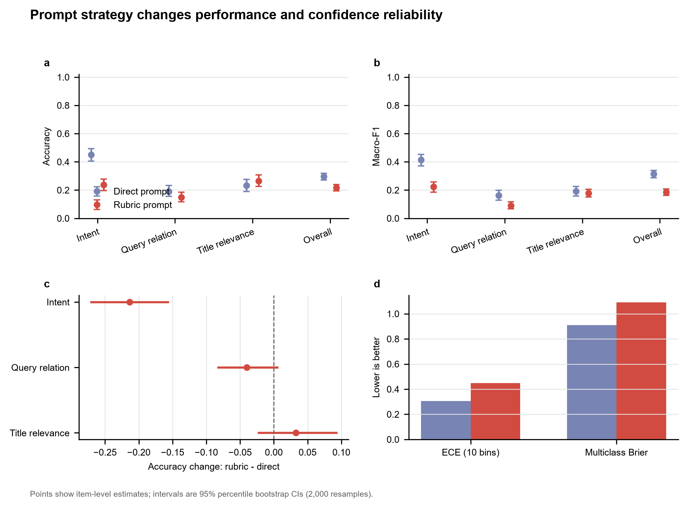

<div align="center">
  <h1>MedEval-DataOps</h1>
  <p><strong>中文医疗大模型评测与数据策略闭环</strong></p>
  <p>真实公开数据 · 本地开源模型 · 配对统计检验 · 可执行数据策略</p>
  <a href="https://github.com/Jacob-Zjy/medeval-dataops/actions/workflows/ci.yml"></a>
  
  
  
  <br><br>
  <a href="https://jacob-zjy.github.io/medeval-dataops/"><strong>在线评测报告</strong></a>
  &nbsp;·&nbsp; <a href="RESULTS.md">实验结果</a>
  &nbsp;·&nbsp; <a href="data/README.md">数据说明</a>
  &nbsp;·&nbsp; <a href="EVALUATION_CARD.md">评测卡</a>
</div>

---

## 为什么做这个项目？

医疗大模型岗位不只需要“调用一个模型”，更需要把业务问题转成可执行的能力标准，建立稳定的 benchmark，发现模型薄弱环节，并据此决定下一批数据应收集、标注或复核什么。

MedEval-DataOps 用一个可复现的最小闭环展示这套工作：


这不是诊断系统，也不评估模型能否独立行医。它评测的是医疗搜索产品中的三项可明确判分的语言理解能力。

## 评测范围

| 任务 | 产品问题 | 样本数 | 主要指标 |
|---|---|---:|---|
| KUAKE-QIC | 用户在问诊断、病因、治疗、费用还是注意事项？ | 440 | Macro-F1、Accuracy |
| KUAKE-QQR | 两个医疗搜索词是等价、包含还是无关？ | 400 | Macro-F1、Accuracy |
| KUAKE-QTR | 搜索词与页面标题的匹配程度如何？ | 400 | Macro-F1、Accuracy |

三项任务来自 PromptCBLUE 验证集，共 **1,240 个独立评测条目**。同一条目分别使用直接提示和规则增强提示，构成配对比较。

## 项目亮点

- **真实模型运行**：使用 Qwen3-0.6B，不用伪造模型输出。
- **受约束判分**：对题目允许的每个标签计算条件似然，避免自由生成造成格式噪声。
- **不仅看准确率**：同时报告 Macro-F1、平衡准确率、ECE、Brier 分数和提示不一致率。
- **统计边界清楚**：2,000 次 item-level bootstrap 给出 95% CI；同一条目使用 McNemar 精确检验，三项任务使用 Benjamini-Hochberg 校正。
- **评测连接数据运营**：将错误率、类别支持度、模型不确定性和提示敏感性组合成透明的数据优先级。
- **防止公开泄漏**：原始医疗文本不提交到 Git；公开索引只保留任务、标签、长度和不可逆哈希。

## 核心发现

| 发现 | 直接提示 | 规则增强提示 | 解释 |
|---|---:|---:|---|
| 总体 Accuracy | 29.6% | 21.8% | 详细 rubric 并未稳定改善小模型 |
| KUAKE-QIC Accuracy | 45.0% | 23.6% | 下降 21.4 个百分点，BH 校正后 `p = 2.72e-12` |
| KUAKE-QTR Accuracy | 23.3% | 26.5% | 上升 3.25 个百分点，但 95% CI 跨 0 |
| 总体 ECE（越低越好） | 0.305 | 0.448 | 规则提示让模型更自信，却更不准确 |

结论不是“prompt 越长越好”，而是：**任何提示策略都要在同一批样本上做配对验证，并同时检查准确性与置信度。** QIC 的结果提示优先回退规则提示，进一步复核长指令造成的注意力稀释和 `非上述类型` 偏置；QTR 的小幅改善需要更多证据，不能直接宣称有效。

<p align="center">
  
</p>

数据处理阶段还识别并修复了 PromptCBLUE QIC 中 `疾病表述` / `疾病描述` 的系统性标签别名，并显式补入上游任务定义允许的 `非上述类型` 拒绝项。映射规则、来源哈希和不重新分发原文的策略均有审计记录。

## 快速复现

建议使用带 NVIDIA GPU 的 Python 3.11/3.12 环境。CPU 可以运行，但完整评测会更慢。

```bash
git clone https://github.com/Jacob-Zjy/medeval-dataops.git
cd medeval-dataops
python -m venv .venv
```

```powershell
# Windows PowerShell
.venv\Scripts\Activate.ps1
python -m pip install --upgrade pip
pip install torch --index-url https://download.pytorch.org/whl/cu128
pip install -e ".[model,analysis,demo,dev]"
```

运行完整流程：

```bash
python -m scripts.download_data
python -m scripts.run_inference --device auto --batch-size 32
python -m scripts.run_evaluation --bootstrap-draws 2000
python -m scripts.make_figures
python -m scripts.build_site
python -m scripts.verify_release
```

本地交互查看：

```bash
streamlit run app.py
```

## 结果如何解释？

完整数字、置信区间和统计检验见 [RESULTS.md](RESULTS.md)，无文本的逐条预测见 [results/predictions.csv](results/predictions.csv)。

这些结果只描述：指定模型版本在指定 PromptCBLUE 子集、指定提示和受约束标签评分协议下的表现。它们**不能**证明临床有效性、医疗安全性或真实用户体验。公开 benchmark 较早，模型训练语料可能包含相似内容，因此还存在污染风险。

## 目录

```text
medevalops/                数据、提示、推理、指标、审计和数据策略核心代码
scripts/                   下载、推理、评估、绘图、网页构建和发布核验
data/processed/            可公开的无文本索引与来源清单
results/                   逐条预测、统计结果、数据质量与优先级表
figures/                   SVG / PDF / PNG / 600-dpi TIFF 科研图
docs/                      GitHub Pages 在线报告
tests/                     不依赖模型权重的核心逻辑测试
app.py                     Streamlit 评测工作台
EVALUATION_CARD.md         数据、模型、指标、统计与限制的统一说明
```

## 数据与合规

PromptCBLUE 是在 CBLUE 基础上构建的中文医疗提示评测。项目提供确定的下载地址、SHA-256、上游引用和处理脚本，但不重新分发原始文本。请在使用数据前自行核对上游竞赛与数据条款。

项目代码采用 [MIT License](LICENSE)。Qwen3-0.6B 模型权重采用其上游 Apache-2.0 许可；本仓库不分发模型权重。

## 引用与来源

- [PromptCBLUE 官方仓库](https://github.com/michael-wzhu/PromptCBLUE)
- [PromptCBLUE 论文](https://arxiv.org/abs/2310.14151)
- [CBLUE 官方仓库](https://github.com/CBLUEbenchmark/CBLUE)
- [CBLUE 论文](https://aclanthology.org/2022.acl-long.544/)
- [Qwen3-0.6B 模型卡](https://huggingface.co/Qwen/Qwen3-0.6B)
