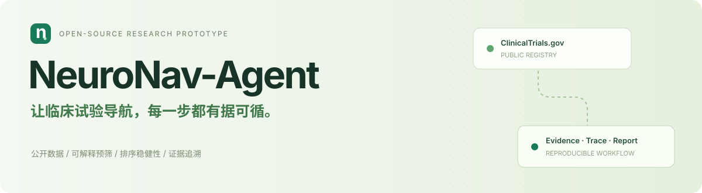
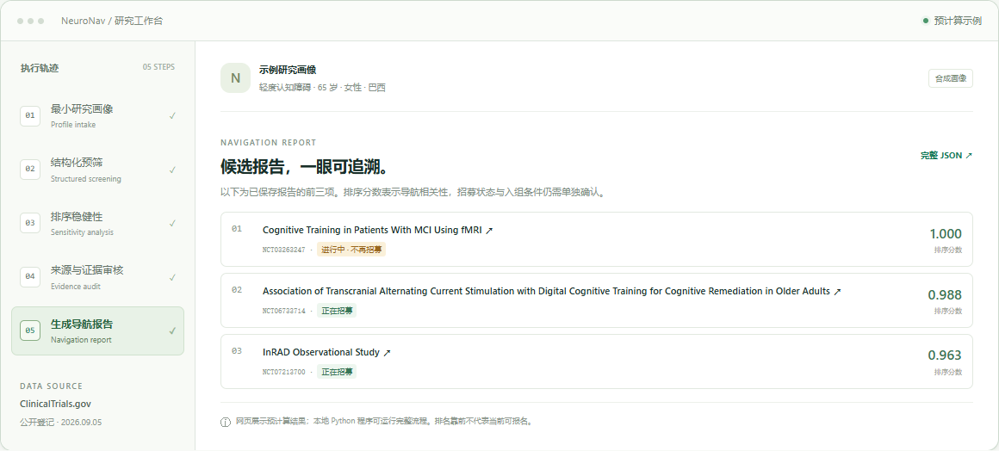

<div align="center">
  
  <br><br>
  <strong>让临床试验导航，每一步都有据可循。</strong>
  <br>
  <p>公开数据 · 结构化预筛 · 可解释排序 · 不确定性分析</p>
  <a href="https://github.com/Jacob-Zjy/neuro-nav-agent/actions/workflows/ci.yml"></a>
  <a href="https://www.python.org/"></a>
  <a href="LICENSE"></a>
  <a href="https://jacob-zjy.github.io/neuro-nav-agent/"></a>
  <br><br>
  <a href="https://jacob-zjy.github.io/neuro-nav-agent/"><strong>在线体验项目总览 ↗</strong></a>
  &nbsp; · &nbsp; <a href="#快速开始">快速开始</a>
  &nbsp; · &nbsp; <a href="#实验结果">实验结果</a>
  &nbsp; · &nbsp; <a href="data/README.md">数据说明</a>
  &nbsp; · &nbsp; <a href="README_en.md">English</a>
</div>

<br>

<a href="https://jacob-zjy.github.io/neuro-nav-agent/">
  
</a>

## 这个项目解决什么问题？

找到疾病名称相似的临床试验后，仍需要核对年龄、登记性别类别、研究状态和地点。NeuroNav-Agent 将这些步骤组织成一个**可追溯、可复现的导航工作流**：读取公开登记信息，检查有限的结构化条件，解释候选排序，并展示排序对权重变化有多敏感。

适合用来研究健康信息导航、工具编排和评估方法。当前版本的关键判断由规则与统计工具完成，**尚未接入大语言模型**；网页中的交互示例展示已保存的运行结果，完整计算可在本地运行。

> 研究原型：候选排序不等于医学建议或最终入组资格。自由文本入排标准和实际招募情况，须由试验协调员确认。

## 一眼看懂

| 公开登记数据 | 受控测试病例 | 排序敏感性分析 | 数据范围 |
|:---:|:---:|:---:|:---:|
| **1,968 条** | **477 个** | **2,000 次** | **无参与者级记录** |
| ClinicalTrials.gov 快照 | 明确标注的合成画像 | 蒙特卡洛权重抽样 | 公开研究元数据 |

数据快照日期为 **2026-09-05（UTC）**，查询覆盖轻度认知障碍、阿尔茨海默病和痴呆。快照包含“进行中但不再招募”的登记记录，不能将全部记录理解为当前可报名的试验。

## 核心能力

| 能力 | 实际实现 |
|---|---|
| 公开数据检索 | 分页读取 ClinicalTrials.gov API v2，保存 NCT 编号、来源链接和快照元数据 |
| 结构化预筛 | 检查疾病、年龄、登记性别类别、研究状态与国家信息，保留逐项判断 |
| 透明排序 | 展示疾病、状态、年龄、性别、地点和信息完整度的得分分量 |
| 稳健性分析 | 改变排序权重，估计候选进入前十的频率，帮助识别不稳定排序 |
| 证据审核 | 检查来源字段、得分范围和人工复核标记 |
| 完整复现 | 提供原始来源、处理后快照、逐病例预测、指标文件、图表和运行脚本 |

## 工作流


输入只有疾病、年龄、登记性别类别和国家。系统输出候选列表、来源字段、排序稳定性和待人工确认事项。运行轨迹可在 [样例报告](results/sample_navigation_report.json) 中查看；[在线总览](https://jacob-zjy.github.io/neuro-nav-agent/) 提供可点选的流程与证据示例。

## 快速开始

建议使用 Python 3.11。复现已发布结果可直接使用仓库内快照，无需 API 密钥。

```bash
git clone https://github.com/Jacob-Zjy/neuro-nav-agent.git
cd neuro-nav-agent
python -m venv .venv
```

激活虚拟环境：

```bash
# macOS / Linux
source .venv/bin/activate

# Windows PowerShell
.venv\Scripts\Activate.ps1
```

安装依赖并启动演示：

```bash
pip install -e ".[analysis,demo,dev]"
streamlit run app.py
```

也可以直接使用命令行：

```bash
python -m neuronav.cli --condition "Mild Cognitive Impairment" --age 65 --sex female --country China
```

## 实验结果

比较关键词检索、部分结构化筛选和完整流程。测试集包含 **477 个合成画像**，由真实登记字段构造受控反例；95% 置信区间来自 2,000 次 bootstrap 重采样。

| 方法 | 平衡准确率 | 95% 置信区间 | 误报率 |
|---|---:|---:|---:|
| 关键词检索 | 0.665 | 0.642–0.690 | 0.669 |
| 部分结构化筛选 | 0.826 | 0.802–0.849 | 0.347 |
| **NeuroNav-Agent** | **0.997** | **0.993–1.000** | **0.006** |

**结果的适用范围：**这个分数反映程序对受控结构化反例的处理表现。测试集和筛选规则共享字段定义，不能据此推断临床准确率、完整入组判断能力或真实患者使用效果。


### 试验分布与排序稳定性

快照中，91.9% 的研究报告了国家信息，7.0% 跨多个国家，最常出现的国家占全部“试验—国家”提及数的 31.3%。这些指标描述登记数据的分布，不能直接解释为人群健康公平性。


图表提供 **SVG / PDF / PNG / 600 dpi TIFF**，保留可编辑矢量版本。访问 [完整图表](figures)、[指标 CSV](results/benchmark_metrics.csv)、[逐病例预测](results/benchmark_predictions.csv) 和 [排序稳定性结果](results/rank_robustness.csv)。

## 从快照复现全部结果

```bash
python -m scripts.build_benchmark
python -m scripts.run_evaluation
python -m scripts.run_analysis
python -m scripts.make_figures
python -m scripts.build_site

# 检查核心行为与交付文件一致性
python -m pytest
python -m scripts.verify_release
```

需要更新登记数据时，单独运行：

```bash
python -m scripts.download_trials
```

重新下载会改变快照，随后需要重跑分析流程。抓取时间、查询词和记录数保存在 [data/metadata.json](data/metadata.json)。

## 目录导航

```text
neuronav/       预筛、排序、审核和流程编排
scripts/        数据获取、评估、分析、绘图与网页构建
data/           公开登记快照、合成测试画像及来源说明
results/        评估指标、逐病例预测和样例导航报告
figures/        可编辑矢量图与高分辨率图片
docs/           在线项目总览及静态资源
tests/          核心逻辑测试
app.py          Streamlit 本地演示
```

## 当前边界与下一步

- 当前流程基于确定性工具编排；大模型交互和自由文本条件提取尚未实现。
- v0.1 将 `ACTIVE_NOT_RECRUITING` 状态纳入候选。它表示研究进行中但不再招募，因此候选排名不能作为可报名清单。
- 国家的有无只能表示登记地点信息，不能衡量交通时间、中心容量、远程参与机会或治疗获益。
- 合成测试用于验证受控软件行为；需要独立人工标注和真实场景评估，才能讨论进一步的应用效果。
- 后续可研究：更严格的招募状态处理、自由文本条件提取、校准后的拒答与试验协调员参与的可用性评价。

## 数据来源与开源协议

研究登记信息来自 [ClinicalTrials.gov API v2](https://clinicaltrials.gov/data-api/about-api)，每条记录保留来源链接；详见 [数据说明](data/README.md)。

代码采用 [MIT License](LICENSE)。登记数据遵循上游来源条款；引用项目可使用 [CITATION.cff](CITATION.cff)。
