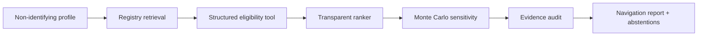
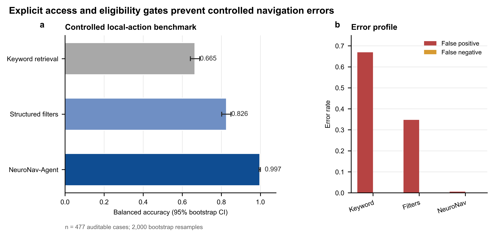
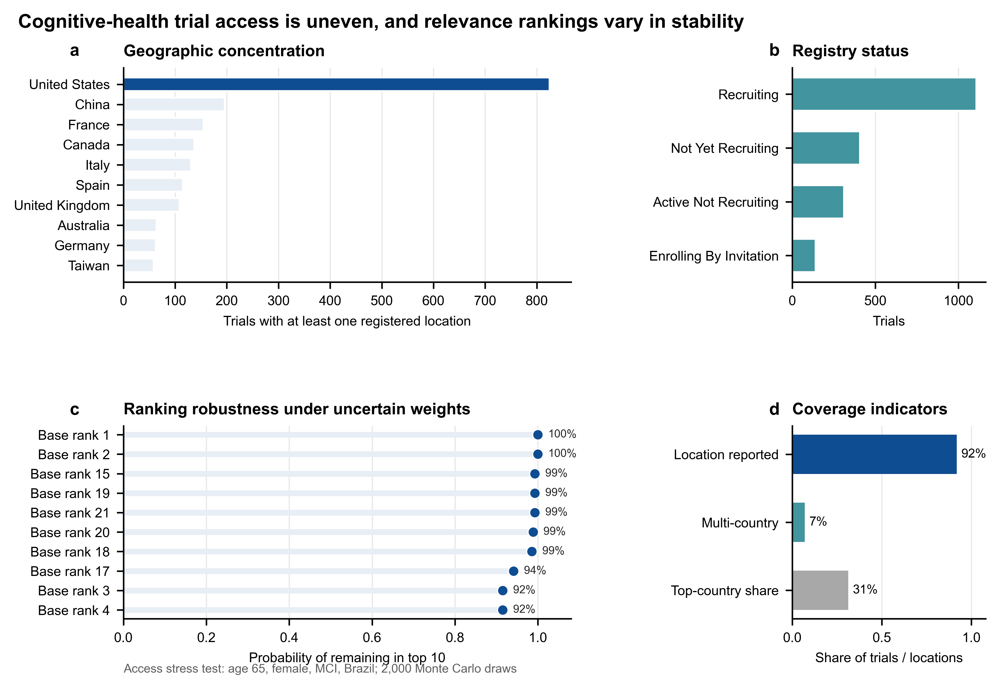

# NeuroNav-Agent

**Evidence-grounded, uncertainty-aware navigation for cognitive-health clinical trials**

[中文说明](README_zh.md) · [Live project guide](https://jacob-zjy.github.io/neuro-nav-agent/) · [Offline HTML](docs/index.html) · [Data provenance](data/README.md)

NeuroNav-Agent is a reproducible research prototype that helps a user find and
compare potentially relevant cognitive-health trials without pretending to
make a diagnosis or a final eligibility decision. The system retrieves public
registry records, applies traceable structured checks, ranks candidates,
measures ranking sensitivity, and audits every recommendation against source
fields.

> **Research use only.** A `potential_match` means that no exclusion was found
> in the limited structured fields checked by this software. Free-text
> inclusion/exclusion criteria, clinical suitability, travel feasibility, and
> medical benefit require human review.

## Why this is an agent rather than a chatbot

The orchestrator executes a bounded workflow with explicit tools and state:



Safety-critical decisions are deterministic and testable. A natural-language
presentation layer could be added later, but it is deliberately absent from
the reported pipeline and must never override eligibility or audit results. In
healthcare, fluent text is not evidence of correctness.

## Reproducible snapshot and results

The committed snapshot contains **1,968 unique, currently open public study registrations**
retrieved from the ClinicalTrials.gov API for Mild Cognitive Impairment,
Alzheimer Disease, and Dementia. It contains no participant-level records or
personal health information.

The controlled benchmark contains **477 explicitly synthetic profiles** created
from registered condition, age, sex, status, and country fields. Controlled
perturbations create auditable negative cases.

| Method | Balanced accuracy | 95% bootstrap CI | False-positive rate |
|---|---:|---:|---:|
| Keyword retrieval | 0.665 | 0.642–0.690 | 0.669 |
| Structured filters | 0.826 | 0.802–0.849 | 0.347 |
| NeuroNav-Agent | 0.997 | 0.993–1.000 | 0.006 |

**Interpretation boundary:** the near-perfect score demonstrates software
correctness on controlled structured-field perturbations. It is **not**
diagnostic accuracy, clinical validation, or evidence that the system can
interpret all free-text eligibility criteria.



The snapshot also shows substantial geographic concentration: 91.9% of trials
report a country, only 7.0% span multiple countries, and the most represented
country accounts for 31.3% of trial-country mentions. These are registry
coverage indicators, not participant-level equity measures.



Editable SVG/PDF and 600 dpi TIFF versions are included in `figures/`.

## Quick start

```bash
python -m venv .venv
source .venv/bin/activate  # Windows: .venv\Scripts\activate
pip install -e ".[analysis,demo,dev]"
python -m pytest
python -m scripts.verify_release
python -m neuronav.cli --condition "Mild Cognitive Impairment" --age 65 --sex female --country China
streamlit run app.py
```

## Reproduce data, benchmark, analysis, and figures

```bash
python -m scripts.download_trials
python -m scripts.build_benchmark
python -m scripts.run_evaluation
python -m scripts.run_analysis
python -m scripts.make_figures
python -m scripts.build_site
```

Re-running the download step creates a new live snapshot and may change results
as trial registrations are updated. `data/metadata.json` records retrieval time,
query terms, and record count.

## Repository map

```text
neuronav/                 matching, ranking, audit, orchestration
scripts/                  reproducible data and experiment pipelines
data/processed/           public registry snapshot
data/benchmark/           synthetic auditable test profiles
results/                  metrics, predictions, coverage, sample report
figures/                  publication-ready SVG/PDF/PNG/TIFF
docs/index.html           visual project explainer
tests/                    unit tests for core safety logic
app.py                    Streamlit demonstration
```

## Design choices

- **Minimal data:** only age, registry sex category, target condition, and
  country are needed. Names, contact details, free-text medical histories, and
  identifiers must not be entered.
- **Evidence trace:** every pass, fail, caution, or unknown points to registered
  source fields.
- **Abstention:** unstructured criteria are always marked for coordinator
  review.
- **Access is not biology:** a country mismatch lowers local actionability but
  is not presented as a medical exclusion.
- **Uncertainty:** candidate ranking is repeated under 2,000 sampled weight sets
  to expose unstable recommendations.
- **No hidden model result:** reported metrics use the deterministic public
  pipeline and require no paid API.

## Limitations and next research steps

1. Free-text eligibility criteria are not yet clinically parsed or validated.
2. Country presence does not represent travel time, site capacity, remote
   participation, participant diversity, or population need.
3. Synthetic test profiles are suitable for software verification, not clinical
   performance claims.
4. A prospective evaluation would require trial coordinators, ethics review,
   protocol-defined outcomes, and representative users.
5. The next technical step is a human-annotated criterion-extraction benchmark
   with calibrated abstention, followed by prospective usability testing.

## Data and citation

Trial metadata come from the
[ClinicalTrials.gov API v2](https://clinicaltrials.gov/data-api/about-api). Each
row includes its registry URL. See [data/README.md](data/README.md) for the exact
construction and claim boundary.

## License

Code is released under the MIT License. Upstream registry data remain subject
to their source terms and attribution requirements.
